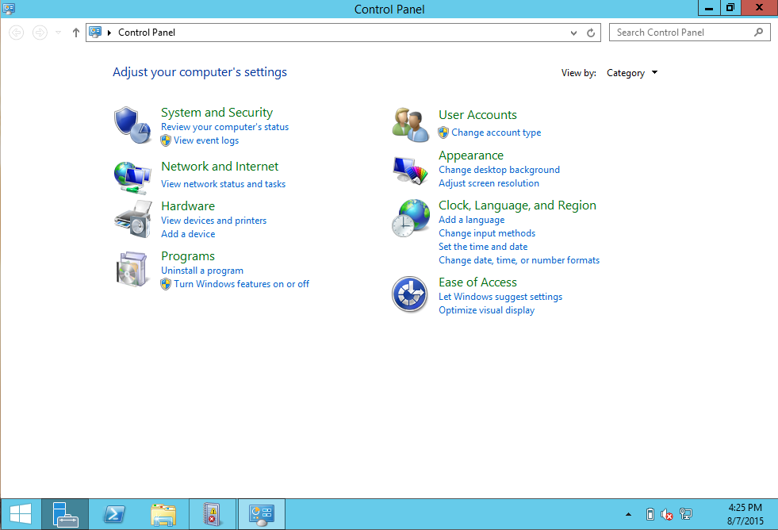
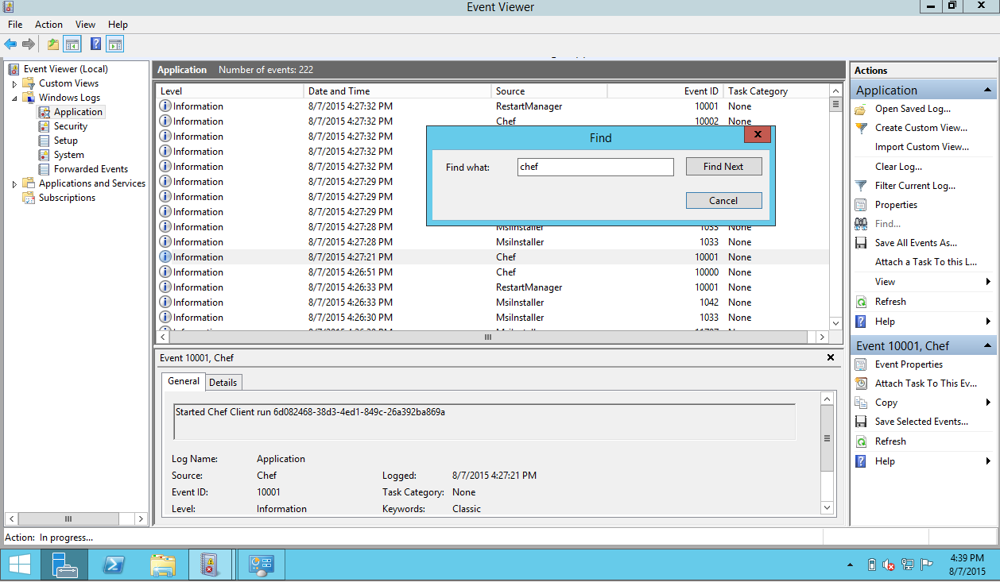

Test Kitchen Windows Tips
-----------------------

##### Requirements
- test-kitchen (I'm using version 1.4)
- the following gems:


#### Background


Having worked at smaller starts ups I've always had the luxury of being able to write cookbooks for a specific platform.  Recently, I needed to author a cookbook that required testing across various platforms.  Thank you [test-kitchen](https://github.com/test-kitchen/test-kitchen)!

For the most part testing under various flavors of unix meant that once you started your convergence and it failed, you could ssh into the box and figure out where it failed.  Doing that for the windows environment required a few changes.  The following outlines a few tips that helped me in testing and converging windows nodes.

##### Install [vagrant-winrm](https://github.com/criteo/vagrant-winrm)

You won't be able to communicate with your windows box without this installed.

```
vagrant plugin install vagrant-winrm
```

##### Finding a Windows Box

The `.kitchen.yml` file makes it easy enough to add new platforms.  Simply add a new line, e.g. `centos-7.0` to your platform list.


```
platforms:
  - name: ubuntu-12.04
  - name: centos-7.0
```

When you use the vagrant driver in test-kitchen, as a convenience, the kitchen vagrant driver will compute and find your box based on the platform's name.  That works for all unix boxes but not on Windows.  With windows, you'll need to specify the driver's box attributes.

Where do you go about finding windows boxes?  They aren't as freely available as unix boxes but I have found that opentable has published several [provisionless windows boxes](https://atlas.hashicorp.com/boxes/search?q=opentable&order=desc&sort=downloads) to hashicorp for testing purposes.

They are easy enough to download and use.  In your `.kitchen.yml` add a windows platform as such:

```
platforms:
  # ...
  - name: windows-2012r2
    driver:
      box: opentable/win-2012r2-standard-amd64-nocm
```

`kitchen converge` now downloads and converges your windows machine.

##### Accessing the Windows Box

On the linux platform, when you converge a box, ssh quickly becomes available and you are able ssh onto the box to tail the logs and investigate its configuration files.  On the windows node I was unable to ssh onto the opentable windows boxes.  To interface with the box, start the VirtualBox and add the following lines to your `.kitchen.yml`

```
platforms:
  # ...
  - name: windows-2012r2
    driver:
      box: opentable/win-2012r2-standard-amd64-nocm
      gui: true
      customize:
        vram: 64
```

This allows the Windows machine to be displayed within the VirtualBox GUI. In order to use it, the system requires a minimum of 64mb of vram.  From here you are able interface with the box to check the event logs and open up configuration files.


##### Investigate and Search the Event Log

On the Windows vm, find your event log under Control Panel -> System and Security -> view event logs.



From here click on the Window Logs -> Application.  On the right, under Action -> Application, click on Find and search for chef.  You'll find your chef output there.  Happy hunting!




* gem winrm-transport
